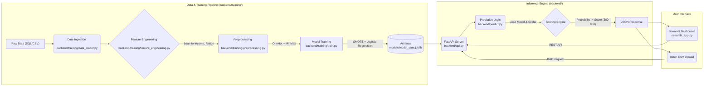

# Credit Risk Modeling & MLOps Pipeline

Credit risk modeling project predicting Probability of Default and Credit Score using Logistic Regression tuned with Optuna on merged customer, loan, and bureau datasets. Includes a modular training pipeline, FastAPI inference engine, and Streamlit dashboard.

## 📊 Project Overview

This application predicts the **Probability of Default (PD)** for loan applicants and assigns a **Credit Score (300-900)** and **Risk Rating**. It is designed to be a complete MLOps solution, moving from a monolithic notebook to a structured, deployable package.

## 🏗️ Architecture

The project follows a modular 3-tier architecture:



## 📈 Model Performance & Metrics

The model evaluation focused on maximizing **Recall** for the "Default" class (Class 1) to minimize financial risk (missing a defaulter is costly).

### Classification Report (Logistic Regression)

| Metric | Precision | Recall | F1-Score | Support |
|--------|-----------|--------|----------|---------|
| **Non-Default (0)** | 1.00 | 0.92 | 0.95 | 11426 |
| **Default (1)** | 0.52 | 0.96 | 0.67 | 1074 |
| **Accuracy** | | | **0.92** | 12500 |
| **Macro Avg** | 0.76 | 0.94 | 0.81 | 12500 |
| **Weighted Avg** | 0.95 | 0.92 | 0.93 | 12500 |

*   **Accuracy**: 92%
*   **Recall (Default)**: **96%** (Key Metric: We catch 96% of potential defaulters)
*   **ROC-AUC**: 0.94

*Note: The precision for defaults is 52%, meaning we have some false positives, but this is a strategic trade-off to ensure maximum risk coverage.*

## 🚀 Automation Pipeline

The training process is fully automated via the API endpoint `POST /train` which orchestrates:

1.  **`backend/training/data_loader.py`**: Merges Customer, Loan, and Bureau datasets.
2.  **`backend/training/feature_engineering.py`**:
    *   Calculates `loan_to_income`, `delinquency_ratio`.
    *   Aligns feature set with notebook definition.
3.  **`backend/training/preprocessing.py`**:
    *   One-Hot Encoding (`drop='first'`) for Categorical variables.
    *   MinMax Scaling for Numerical variables.
4.  **`backend/training/train.py`**:
    *   Splits data (Stratified).
    *   Applies `SMOTE` (Synthetic Minority Over-sampling Technique) for class balancing.
    *   Trains Logistic Regression with notebook-tuned hyperparameters.
    *   Saves artifacts to `models/`.

## 📂 Project Structure

```
credit-risk-model/
├── backend/                # Inference Engine
│   ├── api.py              # FastAPI Server
│   ├── predict.py          # Prediction Logic & Credit Scoring
│   └── training/           # Training Pipeline
│       ├── data_loader.py      # Data Ingestion
│       ├── preprocessing.py    # Cleaning & Scaling
│       ├── feature_engineering.py # Feature Creation
│       ├── train.py            # Model Training Script
│       ├── evaluate.py         # Metrics Calculation
│       └── utils.py            # Helper Functions
├── models/                 # Binary Artifacts
│   ├── model_data.joblib   # Consolidated Artifact (Notebook Compatible)
│   ├── logistic_regression_model.joblib
│   └── preprocessor.joblib
├── streamlit_app.py        # Frontend Dashboard
├── config.py               # Central Configuration
├── requirements.txt        # Dependencies
└── README.md               # Documentation
```

## 💻 Installation & Setup

1. **Clone the repository**:
    ```bash
    git clone <repository-url>
    cd credit-risk-model
    ```

2. **Create a virtual environment**:
    ```bash
    python -m venv venv

    # Windows
    venv\Scripts\activate

    # Linux / Mac
    source venv/bin/activate
    ```

3. **Install Dependencies**:
    ```bash
    pip install -r requirements.txt
    ```

4. **Place dataset files** in `dataset/`:
    - `customers.csv`
    - `loans.csv`
    - `bureau.csv`

### Hugging Face Hub (model versioning)

1. Create an account at [huggingface.co](https://huggingface.co)
2. Go to **Settings → Access Tokens** and create a write-access token
3. Create a model repository (e.g. `YourUsername/credit-risk-model`)
4. Create `backend/.env`:

    ```
    HF_TOKEN=hf_your_token_here
    HF_REPO_ID=YourUsername/credit-risk-model
    ```

The API uploads a versioned tag after each training run and downloads the latest on startup.


## 🚀 Usage

1. **Run the Dashboard**:
    ```bash
    streamlit run streamlit_app.py
    ```
    Access at `http://localhost:8501`.

## 🔄 Notebook vs. Pipeline Alignment

This project ensures strict parity between the research environment (`credit_risk.ipynb`) and the automated pipeline:
*   **Feature Engineering**: Identical logic for derived ratios.
*   **Preprocessing**: Same `OneHotEncoder` configuration (`drop='first'`) and scaling.
*   **Model Parameters**: Exact hyperparameters (`C`, `tol`) transferred from Optuna tuning.
*   **Artifacts**: The pipeline generates a `model_data.joblib` dictionary that mirrors the notebook's saving structure, ensuring seamless portability.

## ⚙️ Credit Scoring Logic

The probability of default ($P_{default}$) is converted to a score (300-900):

$$ Score = 300 + (1 - P_{default}) \times 600 $$

| Score Range | Rating | Risk Decision |
|-------------|--------|---------------|
| 300 - 499 | Poor | 🔴 High Risk |
| 500 - 649 | Average | 🟠 Medium Risk |
| 650 - 749 | Good | 🟡 Low Risk |
| 750 - 900 | Excellent | 🟢 Approved |

## 📜 License

MIT License