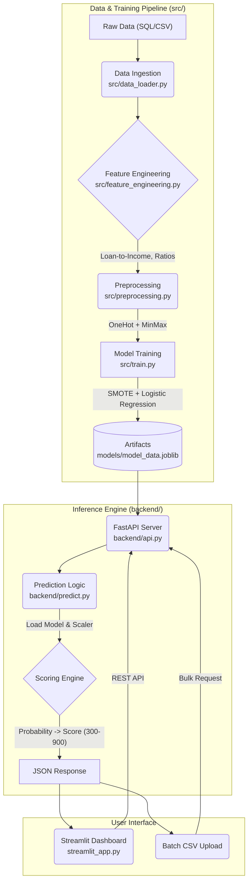

# Credit Risk Modeling & MLOps Pipeline

A production-grade machine learning project for assessing credit risk, featuring a modular training pipeline, FastAPI backend, and Streamlit dashboard.

## 📊 Project Overview

This application predicts the **Probability of Default (PD)** for loan applicants and assigns a **Credit Score (300-900)** and **Risk Rating**. It is designed to be a complete MLOps solution, moving from a monolithic notebook to a structured, deployable package.

## 🏗️ Architecture

The project follows a modular 3-tier architecture:



## 📈 Model Performance & Metrics

The model evaluation focused on maximizing **Recall** for the "Default" class (Class 1) to minimize financial risk (missing a defaulter is costly).

### Classification Report (Logistic Regression)

| Class | Precision | Recall | F1-Score | Support |
|-------|-----------|--------|----------|---------|
| **Non-Default (0)** | 1.00 | 0.92 | 0.95 | 11426 |
| **Default (1)** | **0.52** | **0.96** | **0.67** | 1074 |

*   **Accuracy**: 92%
*   **Recall (Default)**: **96%** (Key Metric: We catch 96% of potential defaulters)
*   **ROC-AUC**: 0.94

*Note: The precision for defaults is 52%, meaning we have some false positives, but this is a strategic trade-off to ensure maximum risk coverage.*

## 🚀 Automation Pipeline

The training process is fully automated via `main.py`:

1.  **`src/data_loader.py`**: Merges Customer, Loan, and Bureau datasets.
2.  **`src/feature_engineering.py`**:
    *   Calculates `loan_to_income`, `delinquency_ratio`.
    *   Aligns feature set with notebook definition.
3.  **`src/preprocessing.py`**:
    *   One-Hot Encoding (`drop='first'`) for Categorical variables.
    *   MinMax Scaling for Numerical variables.
4.  **`src/train.py`**:
    *   Splits data (Stratified).
    *   Applies `RandomUnderSampler` for class balancing (optimized for Recall).
    *   Trains Logistic Regression with notebook-tuned hyperparameters.
    *   Saves artifacts to `models/`.

## 📂 Project Structure

```
credit-risk-model/
├── backend/                # Inference Engine
│   ├── api.py              # FastAPI Server
│   └── predict.py          # Prediction Logic & Credit Scoring
├── src/                    # Training Pipeline
│   ├── data_loader.py      # Data Ingestion
│   ├── preprocessing.py    # Cleaning & Scaling
│   ├── feature_engineering.py # Feature Creation
│   ├── train.py            # Model Training Script
│   ├── evaluate.py         # Metrics Calculation
│   └── utils.py            # Helper Functions
├── models/                 # Binary Artifacts
│   ├── model_data.joblib   # Consolidated Artifact (Notebook Compatible)
│   ├── logistic_regression_model.joblib
│   └── preprocessor.joblib
├── streamlit_app.py        # Frontend Dashboard
├── main.py                 # End-to-End Pipeline Orchestrator
├── config.py               # Central Configuration
├── requirements.txt        # Dependencies
└── README.md               # Documentation
```

## 💻 Installation & Usage

1.  **Clone the repository**:
    ```bash
    git clone <repository-url>
    cd credit-risk-model
    ```

2.  **Install Dependencies**:
    ```bash
    pip install -r requirements.txt
    ```

3.  **Run the Training Pipeline** (Optional, artifacts are pre-generated):
    ```bash
    python main.py
    ```
    *This generates the `models/model_data.joblib` artifact used by the app.*

4.  **Run the Dashboard**:
    ```bash
    streamlit run streamlit_app.py
    ```
    Access at `http://localhost:8501`.

5.  **Run the API**:
    ```bash
    uvicorn backend.api:app --reload
    ```
    Access docs at `http://localhost:8000/docs`.

## 🔄 Notebook vs. Pipeline Alignment

This project ensures strict parity between the research environment (`credit_risk.ipynb`) and the production pipeline:
*   **Feature Engineering**: Identical logic for derived ratios.
*   **Preprocessing**: Same `OneHotEncoder` configuration (`drop='first'`) and scaling.
*   **Model Parameters**: Exact hyperparameters (`C`, `tol`) transferred from Optuna tuning.
*   **Artifacts**: The pipeline generates a `model_data.joblib` dictionary that mirrors the notebook's saving structure, ensuring seamless portability.

## ⚙️ Credit Scoring Logic

The probability of default ($P_{default}$) is converted to a score (300-900):

$$ Score = 300 + (1 - P_{default}) \times 600 $$

| Score Range | Rating | Risk Decision |
|-------------|--------|---------------|
| 300 - 499 | Poor | 🔴 High Risk |
| 500 - 649 | Average | 🟠 Medium Risk |
| 650 - 749 | Good | 🟡 Low Risk |
| 750 - 900 | Excellent | 🟢 Approved |

## 📜 License

MIT License